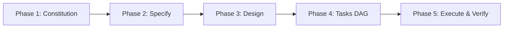

# Spec-Driven Development (SDD) Enterprise

## Purpose
Enforces the 5-phase contract pipeline for building reliable, maintainable software systems with AI agents.

---

## 1. Phase 1: Constitution & Invariants
- Verify that requirements comply with `CONSTITUTION.md` and `AGENTS.md`.
- Reject any request that violates privacy, security boundaries, or SSOT rules.

## 2. Phase 2: Specify (`docs/specs/SPEC-XXX.md`)
- Create formal specifications using EARS syntax:
  - **Ubiquitous:** "The system shall..."
  - **Event-Driven:** "When <trigger>, the system shall..."
  - **State-Driven:** "While <state>, the system shall..."
  - **Error:** "If <condition>, then the system shall..."
  - **Optional:** "Where <flag>, the system shall..."
- Define BDD acceptance scenarios (`Given-When-Then`) for every requirement (`REQ-XX`).

## 3. Phase 3: Technical Design (`docs/design/DESIGN-DOC-XXX.md`)
- Author Mermaid sequence and topology diagrams.
- Define runtime schemas and database indexing strategies.
- Complete STRIDE threat analysis.

## 4. Phase 4: Tasks & Memory Decomposition (`PLAN.md`)
- Break feature down into a Dependency DAG.
- Fill the TDD Triangulation Matrix.
- Include requirement tags (`// Implements: REQ-XX`) on each task.

## 5. Phase 5: Execute & Verify
- Execute TDD cycles (Red -> Green -> Refactor).
- Run fast verification: `npm run verify:fast`.
- Run test-locking guard to verify zero test weakening.
