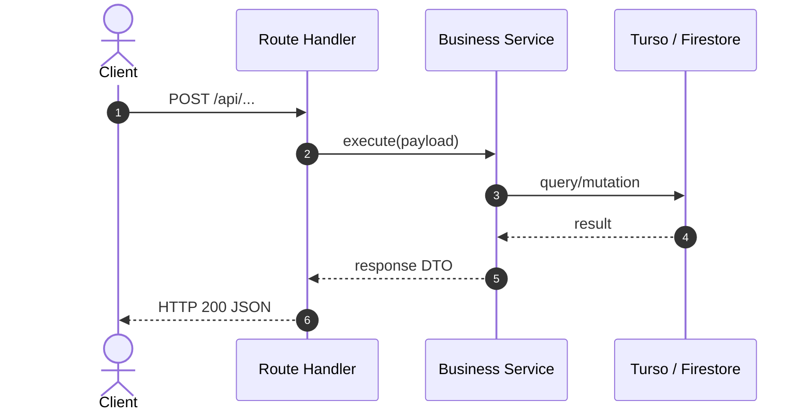

# P[N] — [Feature / Module Name] (SDD Specification)

**Status:** BORRADOR · **Target:** `[paths]` · **Execution Agent:** [agent] · **Design Standard:** `DESIGN.md`

> One feature, one file. Keep narrative prose at 200 lines or fewer — tables and code blocks, not paragraphs. Gherkin blocks (§4) and the task DAG (§6) do not count against that budget.
> Status lifecycle: `BORRADOR` -> `APROBADA` (human sign-off) -> `EN EJECUCION` -> `VERIFICADA`.

---

## 1. Problem Statement & User Intent

[Problem, target users, expected outcome. Three to six lines.]

**Out of scope:** [explicit non-goals and deferred items]

## 2. Domain Glossary

| Term       | Definition   | Boundary / Scope       |
| :--------- | :----------- | :--------------------- |
| `[Entity]` | [Definition] | [Domain layer / Model] |

## 3. Functional Requirements (EARS Syntax)

- **REQ-01 (Ubiquitous):** The system SHALL [action].
- **REQ-02 (Event-Driven):** WHEN [trigger], the system SHALL [response].
- **REQ-03 (State-Driven):** WHILE [in state], the system SHALL [response].
- **REQ-04 (Unwanted Behavior):** IF [invalid condition], THEN the system SHALL [mitigation].
- **REQ-05 (Optional):** WHERE [feature enabled], the system SHALL [behavior].

## 4. Acceptance Criteria (BDD Given-When-Then)

```gherkin
Scenario: [Happy path — REQ-01]
  Given [initial state or preconditions]
  When [action performed]
  Then [expected outcome]
  And [subsequent validation assertion]

Scenario: [Error / edge case — REQ-04]
  Given [preconditions]
  When [invalid input / error trigger]
  Then [error code / fallback behavior]
```

---

## 5. Technical Design

### 5.1 Architecture Topology & Sequence



### 5.2 Data Models & Type Contracts

```typescript
import { z } from "zod";

export const ExampleSchema = z.object({
  id: z.string().uuid(),
  name: z.string().min(1),
  createdAt: z.string().datetime(),
});

export type Example = z.infer<typeof ExampleSchema>;
```

### 5.3 Error Taxonomy & Status Mapping

| Error Type          | Trigger Condition         | HTTP Status | Error Code            | Mitigation Strategy              |
| :------------------ | :------------------------ | :---------- | :-------------------- | :------------------------------- |
| `ValidationError`   | Invalid input payload     | 400         | `BAD_REQUEST`         | Return validation error array    |
| `UnauthorizedError` | Non-institutional session | 403         | `UNAUTHORIZED_DOMAIN` | Redirect to domain policy notice |
| `NotFoundError`     | Entity not found in DB    | 404         | `NOT_FOUND`           | Return 404 with error message    |

### 5.4 Affected Invariants (from `AGENTS.md`)

| Invariant                                                 | Touched? | How it is preserved |
| :-------------------------------------------------------- | :------- | :------------------ |
| Role derivation SSOT (`lib/access-policy.ts` + 4 mirrors) | [yes/no] | [mechanism]         |
| Grade math seam (`lib/grades.ts`)                         | [yes/no] | [mechanism]         |
| Firestore / Storage default-deny                          | [yes/no] | [mechanism]         |
| Study library duplication (`public/biblioteca/`)          | [yes/no] | [mechanism]         |
| Non-official disclaimers                                  | [yes/no] | [mechanism]         |

### 5.5 Scale, Security & Performance Budgets

- Pagination / bounded query strategy at 5,000+ students and hundreds of sections.
- Latency, memory, and payload budgets (each stated as a measurable number).

---

## 6. Task Execution DAG

Each task: 10–50 LOC, cites its `REQ-XX`, states its verification command, and marks `[x]` only after that command passes. Code introduced by a task carries an `// Implements: REQ-XX` marker.

- [ ] **TASK-01: [Data schema / contract definition]**
  - **Requirement:** `REQ-01` · **Depends on:** none
  - **Files:** `[NEW] db/...`
  - **Verification:** `pnpm run test:unit`

- [ ] **TASK-02: [Core service / business logic]**
  - **Requirement:** `REQ-02` · **Depends on:** TASK-01
  - **Files:** `[NEW] lib/...`
  - **Verification:** `pnpm run test:unit`

- [ ] **TASK-03: [API route / endpoint wiring]**
  - **Requirement:** `REQ-03` · **Depends on:** TASK-02
  - **Files:** `[MODIFY] app/api/...`
  - **Verification:** `pnpm test`

- [ ] **TASK-04: [UI component / view integration]**
  - **Requirement:** `REQ-04` · **Depends on:** TASK-03
  - **Files:** `[MODIFY] app/...`
  - **Verification:** `pnpm run lint && pnpm run typecheck`

- [ ] **TASK-05: [Acceptance suite & verification gate]**
  - **Requirement:** all BDD scenarios · **Depends on:** TASK-01..04
  - **Files:** `[NEW] tests/...`
  - **Verification:** `pnpm test && npx react-doctor@latest --verbose`

---

## 7. Phase 5 Sign-Off

- [ ] `pnpm run lint`, `pnpm run typecheck`, `pnpm test` green (output cited)
- [ ] Every BDD scenario maps to a passing assertion
- [ ] Every `REQ-XX` has at least one `Implements:` marker in the tree
- [ ] This spec is included in the same diff as the code implementing it
- [ ] `Status` advanced to `VERIFICADA`; `PLAN.md` updated with handoff notes
