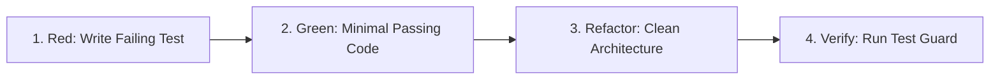

# Test-Driven Development (TDD) & Test Integrity

## 1. Triangulation Workflow

### Triangulation Rules:
1. **Rule of Two:** Do not write production logic without at least two test cases driving the behavior (one happy path + one boundary/error case).
2. **Deterministic Inputs:** Seed any random generation; freeze or mock system clocks.
3. **Explicit Assertions:** Avoid generic `.toBeDefined()` — assert exact structures and values.

---

## 2. Test-Locking Integrity Invariant
- Never weaken existing assertions to make a test pass.
- If existing tests fail during a refactor, either the refactor broke a contract or the specification changed.
- If the specification changed intentionally, update the spec document first before updating tests.
