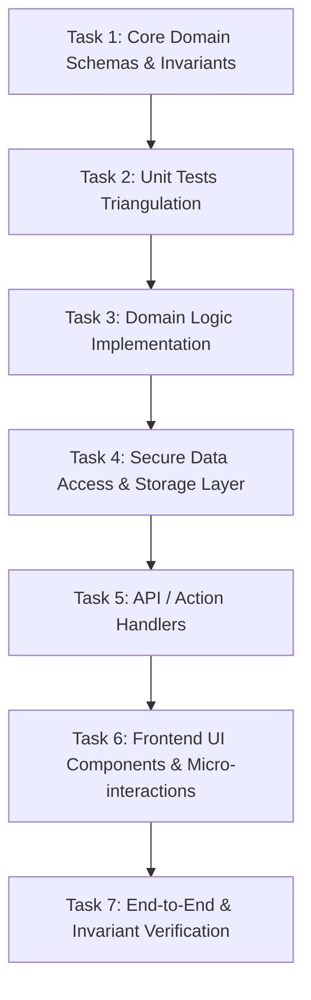

# PLAN.md — Active Execution Memory & Handoff Ledger

> **STATUS:** LIVING DOCUMENT
> AI agents MUST update this document at every milestone and before completing any execution turn.
> This file acts as cross-session working memory, dependency orchestrator, and handoff log.

---

## 1. Active Feature / Objective
- **Feature / Goal:** [Brief description of the current active initiative]
- **Target Specification:** [`docs/specs/SPEC-XXX.md`](docs/specs/)
- **Technical Design Doc:** [`docs/design/DESIGN-DOC-XXX.md`](docs/design/)
- **Target Completion Date / Sprint:** [Active cycle]

---

## 2. Dependency Directed Acyclic Graph (DAG)

---

## 3. Work Breakdown Structure (WBS) & Task Checklist

Legend:
- `[ ]` Pending
- `[/]` In Progress
- `[x]` Completed & Verified

- [ ] **Phase 1: Domain & Contracts**
  - [ ] `T-01`: Define runtime validation schemas and core types. `// Implements: REQ-01`
  - [ ] `T-02`: Define domain error classes and structured response models. `// Implements: REQ-02`

- [ ] **Phase 2: Triangulation & Logic (TDD)**
  - [ ] `T-03`: Write failing unit test suite covering happy paths and edge cases. `// Implements: REQ-01, REQ-02`
  - [ ] `T-04`: Implement pure domain functions to turn tests green. `// Implements: REQ-01, REQ-02`

- [ ] **Phase 3: Persistence & Integration**
  - [ ] `T-05`: Implement transactional repository/storage functions with strict pagination limits. `// Implements: REQ-03`
  - [ ] `T-06`: Implement API endpoint handlers with authentication and schema validation. `// Implements: REQ-04`

- [ ] **Phase 4: User Interface & Polish**
  - [ ] `T-07`: Build UI components using design tokens, spring animations, and WCAG 2.2 contrast. `// Implements: REQ-05`
  - [ ] `T-08`: Implement keyboard navigation and reduced-motion fallbacks. `// Implements: REQ-05`

- [ ] **Phase 5: Verification & Quality Gate**
  - [ ] `T-09`: Execute `npm run verify:fast` and ensure zero test regressions.
  - [ ] `T-10`: Run test-locking guard to verify test assertion integrity.

---

## 4. TDD Triangulation Matrix

| Requirement | Test File | Test Case Description | Status |
| :--- | :--- | :--- | :--- |
| `REQ-01` | `tests/domain.test.ts` | Valid input produces deterministic entity | `[ ]` |
| `REQ-01` | `tests/domain.test.ts` | Malformed input raises validation error | `[ ]` |
| `REQ-02` | `tests/domain.test.ts` | Edge-case boundary condition (zero/null/overflow) | `[ ]` |
| `REQ-03` | `tests/integration.test.ts`| Unauthorized caller receives HTTP 403 / Domain Error | `[ ]` |

---

## 5. Handoff Notes & Context Ledger

<!-- AI agents MUST append structured handoff notes before concluding a turn -->

### Entry: [YYYY-MM-DD HH:MM] — Agent: [Agent Name]
- **Accomplished in this turn:**
  - [List key files created, refactored, or tested]
- **Current Blockers / Decisions Made:**
  - [Note any non-obvious technical decisions or rationale]
- **Next Immediate Action:**
  - [Specify exact next task from the DAG to be picked up]
