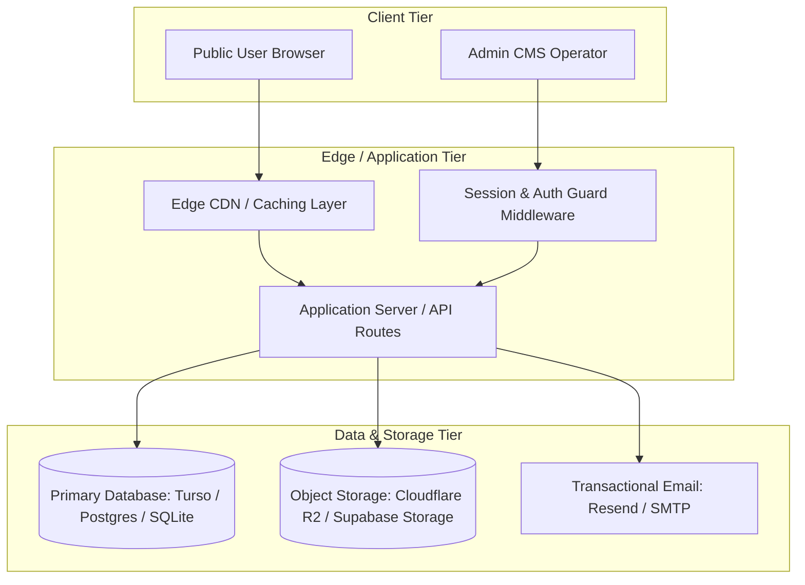

# ARCHITECTURE.md — System Architecture & Standard Stack

> **STATUS:** SYSTEM ARCHITECTURE BLUEPRINT
> Describes system layers, data topologies, standardized tech stack components, and deployment targets.

---

## 1. High-Level System Architecture



---

## 2. Standard Technology Stack

| Layer | Standard Selection | Rationale / Guidelines |
| :--- | :--- | :--- |
| **Framework** | Next.js (App Router) / Vite SPA | React Server Components for SEO + client components for interactive UI |
| **Language** | TypeScript (Strict mode) | Compile-time type safety with zero `any` policy |
| **Styling** | Vanilla CSS / Tailored CSS Tokens | OKLCH color spaces, spring physics, zero CSS bloat |
| **Validation** | Zod / Valibot | Runtime validation at all API and form boundaries |
| **Database** | LibSQL (Turso) / PostgreSQL | Lightweight, relational, serverless-ready with strict indexing |
| **ORM / Query** | Drizzle ORM / Kysely | Type-safe SQL builder with explicit `.limit()` enforcement |
| **Object Storage**| Cloudflare R2 / S3 / Supabase | S3-compatible, edge-distributed media uploads with WebP optimization |
| **Testing** | Node Test Runner / Vitest | Sub-second execution with test-locking guards |

---

## 3. Directory Layout Conventions

```
├── app/                  # Application routing & page views
│   ├── (public)/         # Public marketing & client-facing routes
│   ├── admin/            # Protected self-administrable CMS panel
│   └── api/              # Validated REST / RPC route handlers
├── components/           # Reusable UI component library
│   ├── ui/               # Primitives (Button, Modal, Input, Card)
│   ├── layout/           # Header, Footer, Navigation, Sidebar
│   └── admin/            # CMS editor controls, media managers
├── lib/                  # Pure domain logic & single source of truth
│   ├── db/               # Database client, schemas, migrations
│   ├── services/         # Domain services & mutations
│   └── validations/      # Zod validation schemas
├── public/               # Static assets & public media
├── docs/                 # System architecture, specs & briefs
└── scripts/              # Verification and testing guards
```
