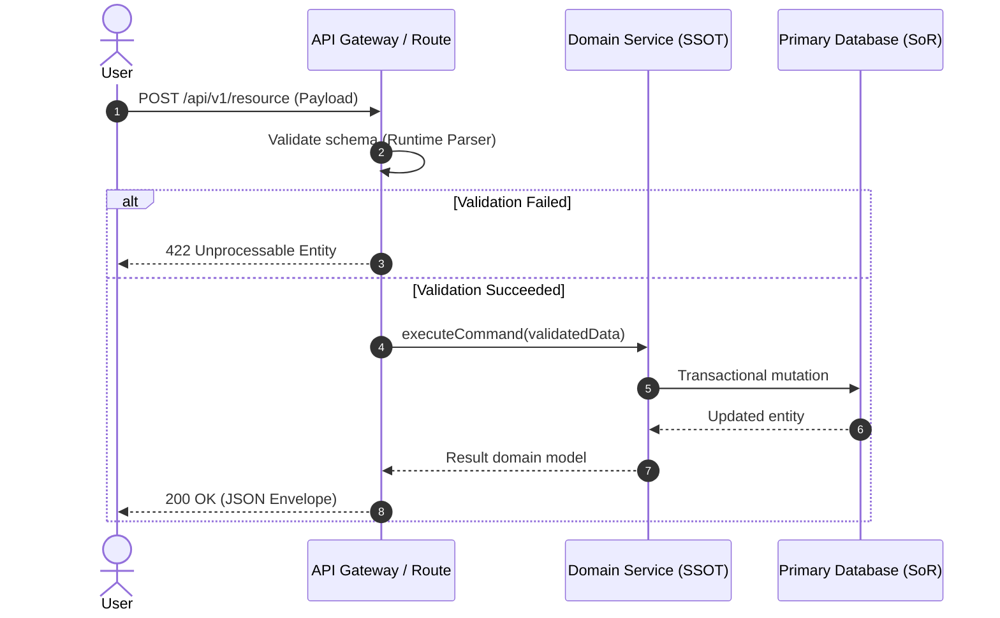

# DESIGN-DOC-000: [Technical Architecture Title]

> **STATUS:** PROPOSED | ACCEPTED | IMPLEMENTED | SUPERSEDED
> **Related Spec:** [`docs/specs/SPEC-000.md`](docs/specs/SPEC-000.md)
> **Author(s):** [Author Name / AI Agent]
> **Date:** [YYYY-MM-DD]

---

## 1. Architectural Topology & Component Interaction



---

## 2. Data Models & Schemas

### 2.1 Domain Entity / Schema Definition

```typescript
// Runtime schema definition (Single Source of Truth)
import { z } from "zod";

export const ResourceSchema = z.object({
  id: z.string().uuid(),
  name: z.string().min(1).max(100),
  status: z.enum(["pending", "active", "archived"]),
  createdAt: z.date(),
  updatedAt: z.date(),
});

export type Resource = z.infer<typeof ResourceSchema>;
```

### 2.2 Relational / Persistence Schema & Indices

- **Table:** `resources`
- **Primary Key:** `id` (`VARCHAR(36)` / `UUID`)
- **Indices:**
  - `idx_resources_status_created` (`status`, `created_at DESC`) for bounded pagination.

---

## 3. Threat Model (STRIDE Analysis)

| Threat Category            | Potential Risk                     | Mitigation Invariant                             |
| :------------------------- | :--------------------------------- | :----------------------------------------------- |
| **Spoofing**               | Impersonation of caller            | Cryptographically verified session token         |
| **Tampering**              | Modification of payload parameters | Strict schema validation discarding unknown keys |
| **Repudiation**            | Untracked critical operations      | Structured audit logging on mutations            |
| **Information Disclosure** | PII or internal IDs leaked         | DTO response mapping stripping private fields    |
| **Denial of Service**      | Unbounded list queries             | Mandatory `.limit(N)` with max threshold of 50   |
| **Elevation of Privilege** | Unauthorized role access           | Role policy validation in domain layer           |

---

## 4. Failure Modes, Resilience & Observability

- **Database Connection Failure:** Return HTTP 503 with standard `Retry-After` header.
- **External Dependency Timeout:** Circuit breaker timeout configured at 3000ms.
- **Structured Error Envelope:**
  ```json
  {
    "error": {
      "code": "RESOURCE_NOT_FOUND",
      "message": "The requested resource does not exist.",
      "timestamp": "2026-08-17T21:00:00Z"
    }
  }
  ```
