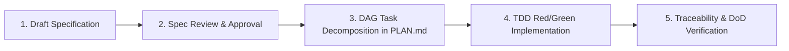

# Specification Directory (`docs/specs/`)

This directory houses all formal functional specifications written using **Spec-Driven Development (SDD)**.

---

## 1. Specification Lifecycle



---

## 2. Requirement Syntax: EARS (Easy Approach to Requirements Syntax)

Every requirement in a specification must follow one of the 5 canonical EARS patterns:

1. **Ubiquitous:** "The system shall `<action>`."
2. **Event-Driven:** "When `<trigger>`, the system shall `<action>`."
3. **State-Driven:** "While `<system is in state>`, the system shall `<action>`."
4. **Unwanted Behavior / Error Case:** "If `<error condition>`, then the system shall `<fallback/error response>`."
5. **Optional Feature:** "Where `<feature flag is enabled>`, the system shall `<action>`."

---

## 3. Code Traceability Marker

When implementing code for a requirement defined in `SPEC-XXX.md`, annotate functions, handlers, schemas, and tests with:

```typescript
// Implements: REQ-XX
```

This allows automated scripts to verify that every specified requirement is implemented and tested with 100% traceability.
